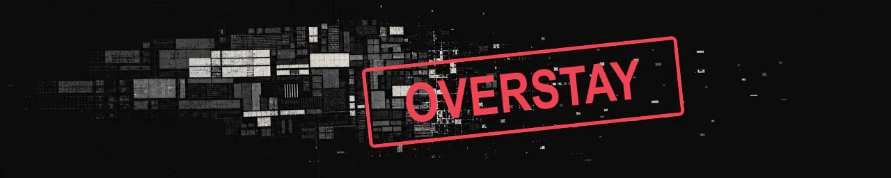

# cargo-overstay

A small tool that keeps Rust `target/` directories from filling your disk. Run
it manually, or install its optional `cargo` shim for automatic cleanup.

## Install

```sh
cargo install cargo-overstay
```

Upgrading from the old `overstay` crate? First run `cargo uninstall overstay`,
remove its shim and `~/.overstay`, then repeat the shim setup below. Tracking
state starts fresh.

## Use it manually

```sh
cargo overstay purge                              # reclaim tracked targets
cargo overstay purge --include-untracked          # also scan under your home
cargo overstay purge --include-untracked ~/work   # scan a narrower location
cargo overstay ls                                 # show tracked projects
```

By default, `purge` only considers targets recorded by the cargo shim. Pass
`--include-untracked` to also discover Cargo targets under a directory.
`purge` validates targets before deleting them, asks before removing ambiguous
matches, and skips active builds. It never follows symlinks or touches a
scanned `target/` without a sibling `Cargo.toml`.

## Enable automatic cleanup (optional)

Create a `cargo` symlink to overstay in a dedicated directory:

```sh
mkdir -p ~/.cargo-overstay/bin
ln -sf "$(command -v cargo-overstay)" ~/.cargo-overstay/bin/cargo
```

Put that directory first on `PATH` using your shell's startup file:

```sh
# zsh
echo 'export PATH="$HOME/.cargo-overstay/bin:$PATH"' >> ~/.zshenv

# bash (use the startup file appropriate for your environment)
echo 'export PATH="$HOME/.cargo-overstay/bin:$PATH"' >> ~/.bashrc

# fish
fish_add_path ~/.cargo-overstay/bin
```

Open a new shell. Overstay now forwards every `cargo` command to the real Cargo
and performs maintenance in the background. Keep the shim as a symlink; wrapper
scripts can recurse and copied binaries become stale after upgrades.

Check that it is active:

```sh
command -v cargo
# ~/.cargo-overstay/bin/cargo
```

## Configure size limits

The size limits can be overridden with a TOML config file:

```toml
max_total_size = "150GiB"
max_target_size = "25GiB"
```

The default location is `~/Library/Application Support/cargo-overstay/config.toml`
on macOS. On Linux it is `$XDG_CONFIG_HOME/cargo-overstay/config.toml` when
that variable is set, otherwise `~/.config/cargo-overstay/config.toml`.
`CARGO_OVERSTAY_CONFIG` can point to a different file. Both settings are
optional and accept binary or decimal units such as `GiB`, `GB`, and `MiB`.

Invalid TOML, unknown settings, and invalid sizes are reported instead of
silently falling back to smaller limits; automatic cleanup remains disabled
until the config is fixed.

## Cleanup policy

Automatic cleanup uses these defaults:

- Unused for 30 days: remove the whole target.
- Larger than 10 GiB (`max_target_size`): trim recognized stale artifacts in place.
- More than 75 GiB (`max_total_size`) across tracked targets: remove
  least-recently-used targets.
- Less than 10 GiB free: remove least-recently-used targets until 20 GiB is free.

Overstay skips active or recently used targets and takes Cargo's build lock
before reclaiming anything. It never removes the project currently being built;
if that project's target exceeds 10 GiB, it only trims recognized artifacts.

## Uninstall

```sh
rm ~/.cargo-overstay/bin/cargo
# remove the PATH line from your shell config
cargo uninstall cargo-overstay
```

Optional state files live at `~/.local/share/cargo-overstay` on Linux
(`XDG_DATA_HOME` is honored) and `~/Library/Application Support/cargo-overstay`
on macOS.

## License

MIT
